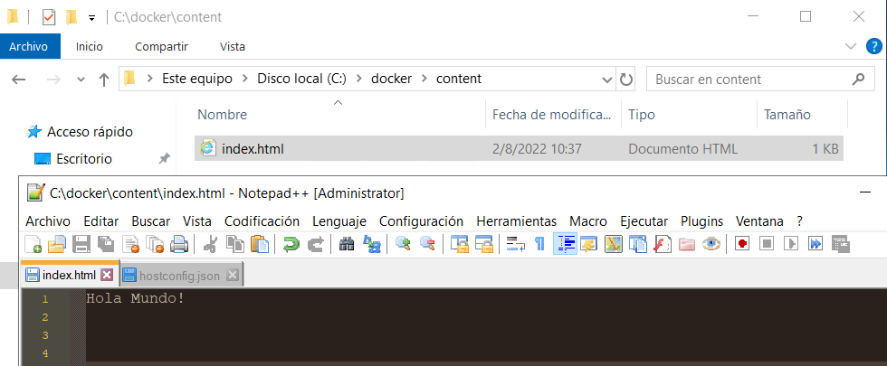

# Run docker on Windows Server 2019
> We are going to see how to install docker on Windows Server 2019, not Docker Desktop.

## Table of Contents
* [General Info](#general-information)
* [Technologies Used](#technologies-used)
* [Setup](#setup)
* [Usage](#usage)

<!-- * [License](#license) -->

## General Information
- We are going to see how to install docker engine on Windows Server 2019, not Docker Desktop.
- Sometimes we don't want to install Docker Desktop but work directly on the server through rdp session.
- I made this tutorial thinking about the container environment for Windows platform developers.

<!-- You don't have to answer all the questions - just the ones relevant to your project. -->

## Technologies Used
- Windows Server 2019, preferably ver 1809
- Remote Desktop client

## Setup
The only prerequisite is to have windows server installed. It can be in an on-premise virtual machine, physical server implementation or an instance running in Azure.

## Usage
Run powershell as administrator or a user with perms.  

*Install the Docker-Microsoft PackageManagement Provider from the PowerShell Gallery:  
**Install-Module -Name DockerMsftProvider -Repository PSGallery -Force**   

Agree using “Yes” or “Y” or “A” to Agree to all.  

*Install the latest Docker Engine and Client  
**Install-Package -Name docker -ProviderName DockerMsftProvider**  

Check docker version:  
**docker -v**  

Install Docker Compose CLI plugin, first we must enable TLS1.2. Run the following:  
**[Net.ServicePointManager]::SecurityProtocol = [Net.SecurityProtocolType]::Tls12**  

Download the latest release of compose v2.7.0:  
**Invoke-WebRequest "https://github.com/docker/compose/releases/download/v2.7.0/docker-compose-Windows-x86_64.exe" -UseBasicParsing -OutFile $Env:ProgramFiles\Docker\docker-compose.exe**  

Start docker service  
**Start-Service Docker**  

------------  
It doesn't hurt to do:  

Disable windows defender: **Uninstall-WindowsFeature -Name Windows-Defender**    

Install choco package distribution:   
**Set-ExecutionPolicy Bypass -Scope Process -Force; [System.Net.ServicePointManager]::SecurityProtocol = [System.Net.ServicePointManager]::SecurityProtocol -bor 3072; iex ((New-Object System.Net.WebClient).DownloadString('https://community.chocolatey.org/install.ps1'))**    

Install notepad++: **choco install notepadplusplus**    

Install firefox: **choco install firefox** 

------------  
[Repo IIS docker](https://github.com/microsoft/iis-docker)

Publish sample static page.  Ccreate folder with content folder inside

Put your website in content folder:  
  

In addition to the site content you need the Dockerfile  
  

 Build your iis-site  
 **docker build -t iis-site .**  
 
 Run container, please red this before: https://phoenixnap.com/kb/docker-run-command-with-examples  
 **docker run -d -p 8050:80 --name sitio-iis iis-site**  
 
   
 
 In browser:  
   
 
